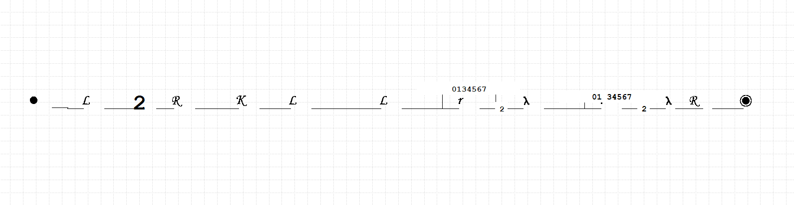
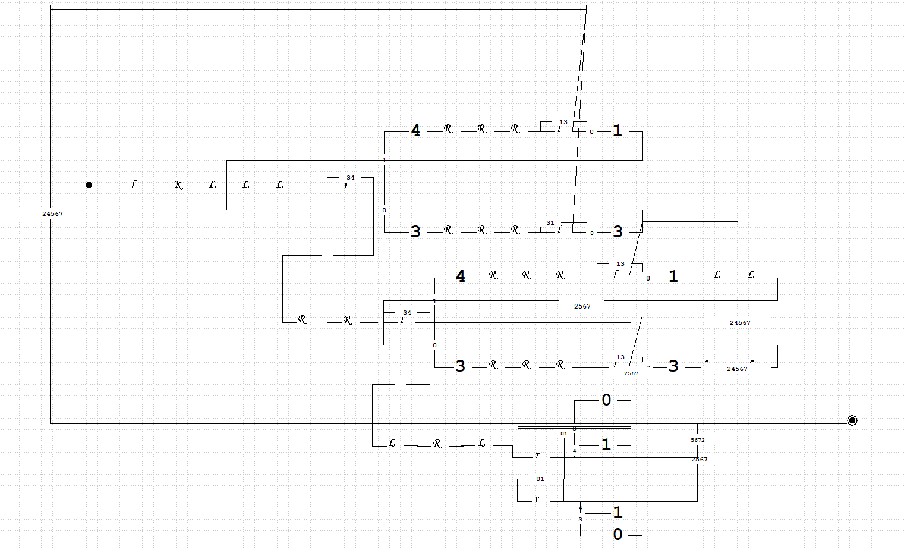
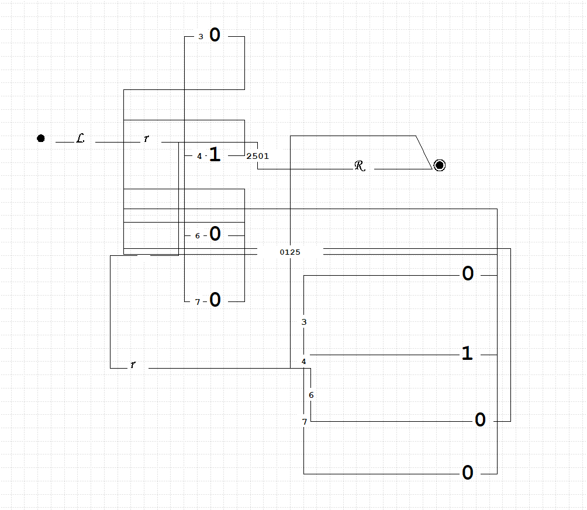
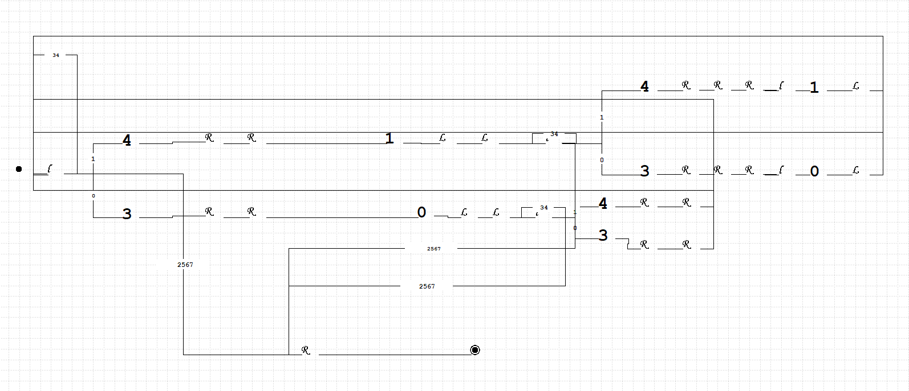
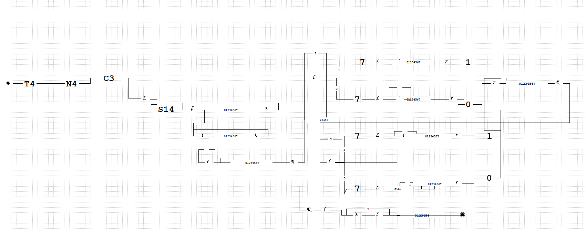

# Отчет по лабораторной работе №4 по курсу "Фундаментальная информатика"
___Студент группы:___ М8О-108Б-22 \
___ФИО:___ Сибирцев Роман Денисович \
___Почта:___ sibirtsevr1@gmail.com \
___Преподаватель:___ Сахарин Никита Александрович 

### 1. Тема
 __Конструирование диаграмм Тьюринга__

### 2. Цель работы
__Составить диаграмму машины Тьюринга в четвёрках__

### 3. Задание
__Вычисление поразрядной конъюнкции двух двоичных чисел (слова разной длины, дополняются 0
слева).__
### 4. Оборудование
___Прицессор___: AMD Ryzen 5 3600 (12) @ 3.600GHz \
___ОП___: 15944MiB \
___SSD___: 1TB
___Монитор___: 1920:1080

### 5. Программное обеспечение
___Операционная система семейства___ UNIX, ___наименование___ Ubuntu Linux, ___версия___ 5.15.0-47-generic
___Интерпритатор команд___ bash, ___версия___ 5.1.16

### 6. Идея, метод, алгоритм решения
Для решения задачи воспользуемся диаграммером Тьюринговых вычислений VTM (Virtual Turing Machine)

### 7. Сценарий выполнения работы
### Составим диаграмму Тьюринга для решения поставленной задачи 
#### Для удобства разобьем задачу на несколько подсзадач, и для каждой подзадачи соствим свою диагрмму машины Тьринга. В конце объединим все машины в одну диаграмму.

### 9. Дневник отладки должен содержать дату и время сеансов отладки и основные события (ошибки в сценарии и программе, нестандартные ситуации) и краткие комментарии к ним. В дневнике отладки приводятся сведения об использовании других ЭВМ, существенном участии преподавателя и других лиц в написании и отладке программы.

| № |  Лаб. или дом. | Дата | Время | Событие | Действие по исправлению | Примечание |
| ------ | ------ | ------ | ------ | ------ | ------ | ------ |
| 1 | дом. | 21.10.22 | 13:00 | Выполнение лабораторной работы | - | - |

### 9. Выводы
Были получены принципы составления диаграмм для машины Тьюринга. 
