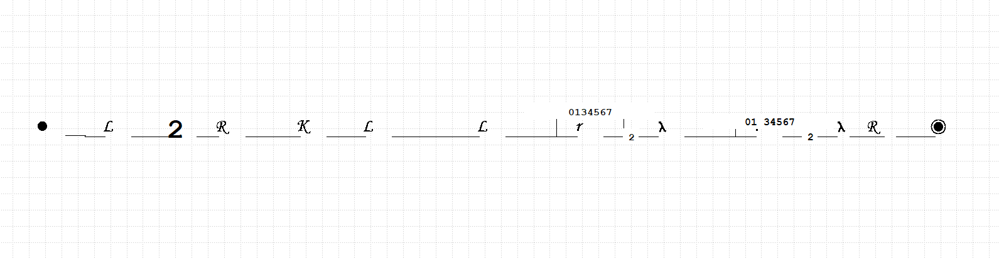
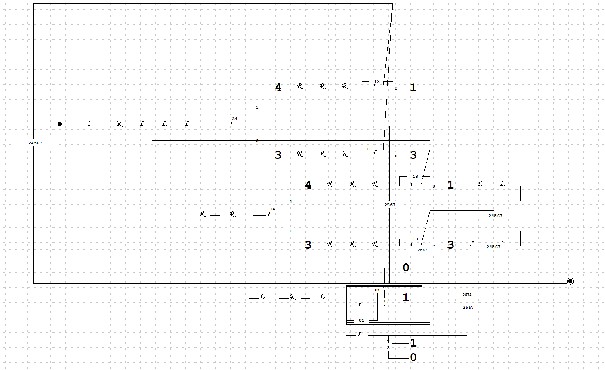
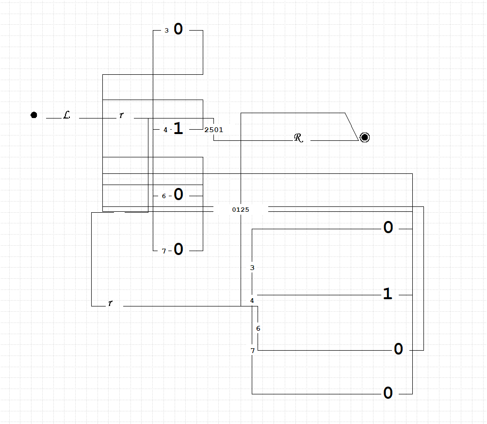
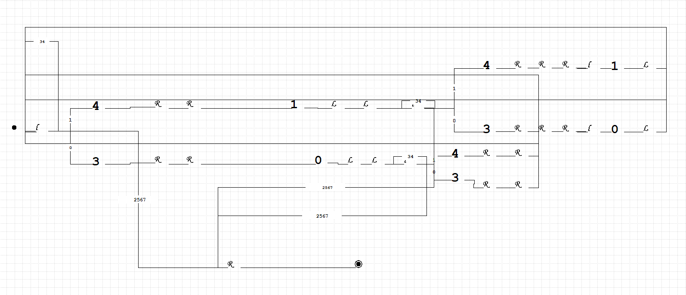
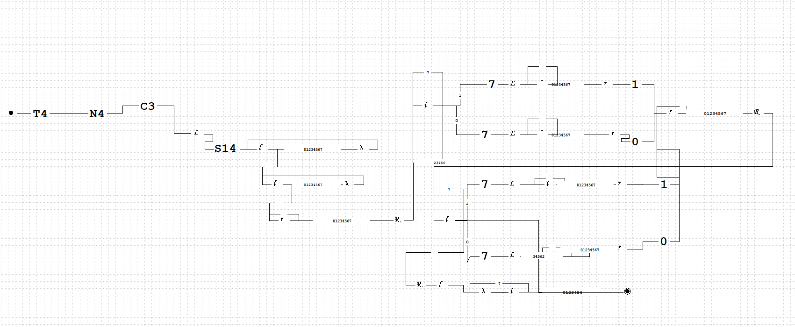

# Отчет по лабораторной работе №6 по курсу "Фундаментальная информатика"
___Студент группы:___ М80-108Б-22 Сибирцев Роман Денисович \
___Контакты e-mail:___ sibirtsevr1@gmail.com \
___Работа выполнена:___ «13» октября 2022 г. \
___Преподаватель:___ асп. каф. 806 Сахарин Никита Александрович \
___Входной контроль знаний с оценкой:___ 5 (отлично) \
___Отчет сдан___ «13» октября 2022 г., ___итоговая оценка___ 5 (отлично)

Подпись преподавателя: ________________ 

## 1. Тема
 _Конструирование диаграмм Тьюринга_
## 2. Цель работы
_Составить диаграмму машины Тьюринга в четвёрках_

## 3. Задание
_Вычисление поразрядной конъюнкции двух двоичных чисел (слова разной длины, дополняются 0
слева)._
### 4. Оборудование
___Прицессор___: AMD Ryzen 5 3600 (12) @ 3.600GHz \
___ОП___: 15944MiB \
___SSD___: 1TB
___Монитор___: 1920:1080

### 5. Программное обеспечение
___Операционная система семейства___ UNIX, ___наименование___ Ubuntu Linux, ___версия___ 5.15.0-47-generic
___Интерпритатор команд___ bash, ___версия___ 5.1.16

### 6. Идея, метод, алгоритм решения
Для решения задачи воспользуемся диаграммером Тьюринговых вычислений VTM (Virtual Turing Machine)

## 7. Сценарий выполнения работы
#### Составим диаграмму Тьюринга для решения поставленной задачи 
#### Для удобства разобьем задачу на несколько подсзадач, и для каждой подзадачи соствим свою диагрмму машины Тьринга. В конце объединим все машины в одну диаграмму.

## 8. Распечатка протокола

## 9. Дневник отладки должен содержать дату и время сеансов отладки и основные события (ошибки в сценарии и программе, нестандартные ситуации) и краткие комментарии к ним. В дневнике отладки приводятся сведения об использовании других ЭВМ, существенном участии преподавателя и других лиц в написании и отладке программы.

| № |  Лаб. или дом. | Дата | Время | Событие | Действие по исправлению | Примечание |
| ------ | ------ | ------ | ------ | ------ | ------ | ------ |
| 1 | дом. | 13.10.22 | 13:00 | Выполнение лабораторной работы | - | - |

## 10. Замечания автора по существу работы — Реализовать функцию A \ B (логическая разность множеств)
Выполнение дополнительного задания.
A \ B = A and not B
Задача сводится в предыдущей, за одним лишь различием (необходимо инвертировать второе число)

## 11. Выводы
Были изучены базовые команды для построения диаграммы Тьюринга. Был продуман и написан алгоритм для выполнения лабораторной работы. Были приобретены навыки, необходимые для дальнейшего обучения.

Подпись студента: _________________