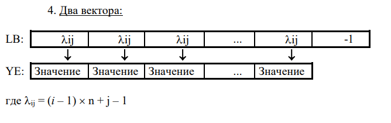

# Отчет по курсовому проекту по заданию №7 по курсу "Фундаментальная информатика"

___Студент группы:___ М80-108Б-22 Сибирцев Роман Денисович \
___Контакты e-mail:___ sibirtsevr1@gmail.com \
___Работа выполнена:___ «20» июня 2023 г. \
___Преподаватель:___ асп. каф. 806 Сахарин Никита Александрович \
___Отчет сдан___ «20» июня 2023 г., ___итоговая оценка___ 
Подпись преподавателя: ________________ 

## 1. Тема

Разреженные матрицы

## 2. Цель работы

Составить программу на языке Си с процедурами и/или функциями для обработки прямоугольных разреженных матриц

## 3. Задание

Составить программу на языке Си с процедурами и/или функциями для обработки прямоугольных разреженных матриц с
элементами целого (группы 6, 8), вещественного (группы 2-5), или комплексного (группы 1, 7) типов, которая:
1. вводит матрицы различного размера, представленные во входном текстовом файле в обычном формате (по строкам),
с одновременным размещением ненулевых элементов в разреженной матрице в соответствии с заданной схемой;
2. печатает введенные матрицы во внутреннем представлении согласно заданной схеме размещения и в обычном
(естественном) виде;
3. выполняет необходимые преобразования разреженных матриц (или вычисления над ними) путем обращения к
соответствующим процедурам и/или функциям;
4. печатает результат преобразования (вычисления) согласно заданной схеме размещения и в обычном виде
5. Умножить вектор-строку на разреженную матрицу и вычислить количество ненулевых элементов результата.


## 4. Оборудование
___Прицессор___: AMD Ryzen 5 3600 (12) @ 3.600GHz \
___ОП___: 15944MiB \
___HDD___: 1TB
## 5. Программное обеспечение
___Операционная система семейства___ UNIX, ___наименование___ Manjaro Linux, ___версия___  5.15.65-1-MANJARO
___Интерпритатор команд___ bash, ___версия___ 5.1.16
___Редактор текстов___ nano
## 6. Идея, метод, алгоритм решения

## 7. Сценарий выполнения работы
main.c
```c
#include <stdlib.h>
#include <stdio.h>

#include "matrix.h"

void printMenu() {
    printf("0 - print menu\n"
           "1 - print simple matrix\n"
           "2 - print matrix\n"
           "3 - multiplication\n" 
           "4 - exit\n");
}


int main(int argc, char* argv[]) {
    FILE *file;
    if (argc == 2)
        file = fopen(argv[1], "r");
    else 
        file = fopen("t1.txt", "r");
    Matrix matrix;
    matrixCreate(&matrix);
    matrixScan(file, &matrix);
    printMenu();
    int a;
    while (1) {
        scanf("%d", &a);
        if (a == 0) 
            printMenu();
        else if (a == 1)
            matrixPrint(&matrix);
        else if (a == 2)
            matrixPrintTable(&matrix);
        else if (a == 3) {

            size_t *arr[2];
            matrixGetSize(&matrix, arr);
            size_t n = *arr[0];
            int string[n];
            printf("enter vector (1x%ld)   ", n);
            for (int i = 0; i < n; ++i) 
                scanf("%d", &string[i]);
            func(&matrix, string);
        } else if (a == 4) {
            matrixDestroy(&matrix);
            fclose(file);
            break;
        }
        else
            printf("incorrect parametr\n");
    }
}
```
matrix.h
```c
#ifndef MATRIX_H
#define MATRIX_H

#include <stdlib.h>
#include <stdio.h>

typedef struct {
    size_t n, m, size;
    int *lb;
    int *ye;
} Matrix;

void matrixCreate(Matrix *matrix);

void matrixDestroy(Matrix *matrix);

void matrixScan(FILE *file, Matrix *matrix);

void matrixPrint(Matrix *matrix);

void matrixPrintTable(Matrix *matrix);

void matrixResize(Matrix *matrix);

void matrixSet(Matrix *matrix, int val, int i, int j);

int matrixGet(Matrix *matrix, size_t i, size_t j);

void matrixGetSize(Matrix *matrix, size_t **arr);

void func(Matrix *matrix, int* arr);

#endif // MATRIX_H
```
matrix.c
```c
#include <stdlib.h>
#include <stdio.h>

#include "matrix.h"

void matrixCreate(Matrix *matrix) {
    matrix->n = 0;
    matrix->m = 0;
    matrix->size = 0;
    matrix->ye = NULL;
    matrix->lb = NULL;
}

void matrixDestroy(Matrix *matrix) {
    free(matrix->lb);
    free(matrix->ye);
    matrix->n = 0;
    matrix->m = 0;
    matrixCreate(matrix);
}

void matrixResize(Matrix *matrix) {
    if (matrix->size == 0) {
        matrix->size = 1;
        matrix->ye = malloc(sizeof(int));
        matrix->lb = malloc(sizeof(int)*2);
        matrix->lb[0] = -1;
    }
    else {
        matrix->size = matrix->size * 2;
        matrix->ye = realloc(matrix->ye, sizeof(int)*matrix->size);
        matrix->lb = realloc(matrix->lb, sizeof(int)*(matrix->size + 1));
    }
}

void matrixSet(Matrix *matrix, int val, int i, int j) {
    int k = 0;

    if (matrix->size == 0) matrixResize(matrix);

    for(; k < matrix->size; ++k)
        if (matrix->lb[k] == -1)
            break;

    if (k == matrix->size) matrixResize(matrix);

    matrix->lb[k] = i * matrix->m + j;
    matrix->lb[k + 1] = -1;
    matrix->ye[k] = val;
}


int matrixGet(Matrix *matrix, size_t i, size_t j) {
    for (int k = 0; matrix->lb[k] != -1; ++k) {
        if (matrix->lb[k] == i * matrix->m + j)
            return matrix->ye[k];
    }
    return 0;
}

void matrixScan(FILE *file, Matrix *matrix) {
    fscanf(file, "%ld %ld", &matrix->n, &matrix->m);
    int val;
    for (int k = 0; k < matrix->n*matrix->m; ++k) {
        fscanf(file, "%d", &val);
        if (val != 0) {
            matrixSet(matrix, val, k / matrix->m, k % matrix->m);
        }
    }
}

void matrixPrint(Matrix *matrix) {
    for(int i = 0; i < matrix->size; ++i) {
        if (matrix->lb[i] == -1) break;
        printf("(%d %d)\n", matrix->lb[i], matrix->ye[i]);
    }
}

void matrixGetSize(Matrix *matrix, size_t** arr) {

    arr[0] = &matrix->n;
    arr[1] = &matrix->m;
}

void func(Matrix *matrix, int* arr) {
    int result[matrix->m];
    int v;
    int count = 0;
    printf("res = (");
    for (int i = 0; i < matrix->m; ++i) {
        v = 0;
        for (int j = 0; j < matrix->n; ++j) {
            int val = matrixGet(matrix, j, i);
            v += val * arr[j];
        }
        result[i] = v;
        printf(" %d", result[i]);
        if (result[i] > 0)
            count++;
    }
    printf(" ) count = %d\n", count);
}

void matrixPrintTable(Matrix *matrix) {
    for(size_t i = 0; i < matrix->n; ++i) {
        for(size_t j = 0; j < matrix->m; ++j) 
            printf("%d ", matrixGet(matrix, i, j));
        printf("\n");
    }
}
```

## 8. Распечатка протокола
```bash
roman@DESKTOP-R7FKK1E:~/fundamentals-of-computer-science-RomanSibirtsev/КП7$ ./main t2.txt 
0 - print menu
1 - print simple matrix
2 - print matrix
3 - multiplication
4 - exit
2
0 0 0 0 0 0 0 
0 0 5 0 0 2 0 
0 0 0 6 0 0 0 
0 0 0 0 0 0 0 
0 0 0 7 0 0 8 
0 0 0 0 0 0 0 
3
enter vector (1x6)   4 5 6 7 3 2
res = ( 0 0 25 57 0 10 24 ) count = 4
```

## 9. Дневник отладки должен содержать дату и время сеансов отладки и основные события (ошибки в сценарии и программе, нестандартные ситуации) и краткие комментарии к ним. В дневнике отладки приводятся сведения об использовании других ЭВМ, существенном участии преподавателя и других лиц в написании и отладке программы.

| № |  Лаб. или дом. | Дата     | Время | Событие | Действие по исправлению | Примечание |
| ------ | ------ |----------| ------ | ------ | ------ | ------ |
| 1 | дом. | 20.06.22 | 13:00 | Выполнение лабораторной работы | - | - |

## 10. Замечания автора по существу работы


## 11. Выводы
Были изучены динамические структуры данных. Была составлена программа на языке Си для обработки двоичного дерева

Подпись студента _________________
